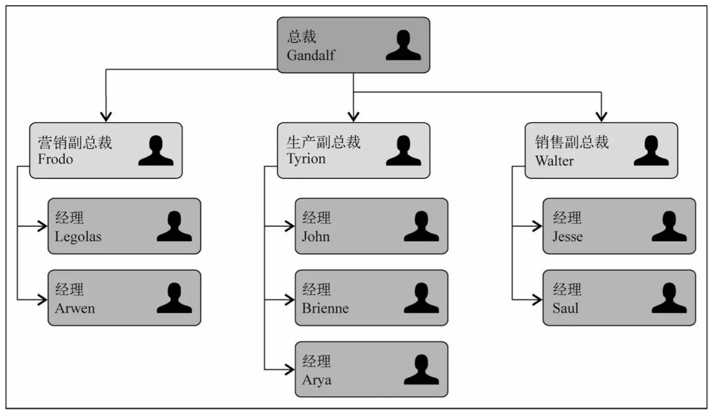
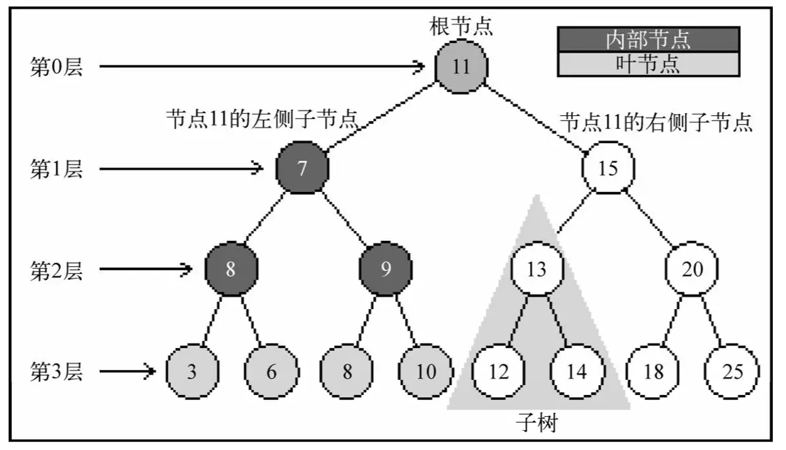
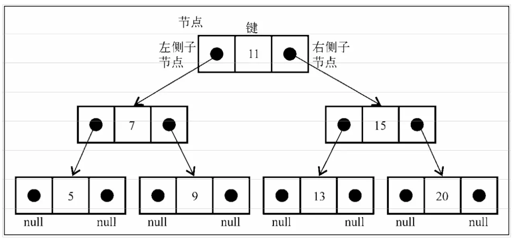
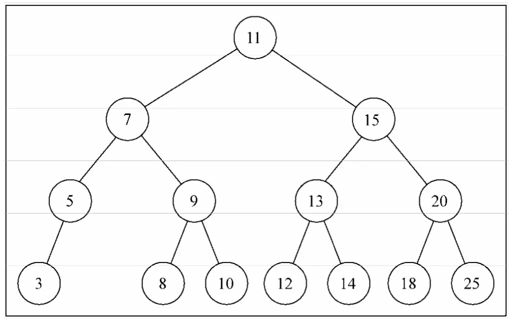
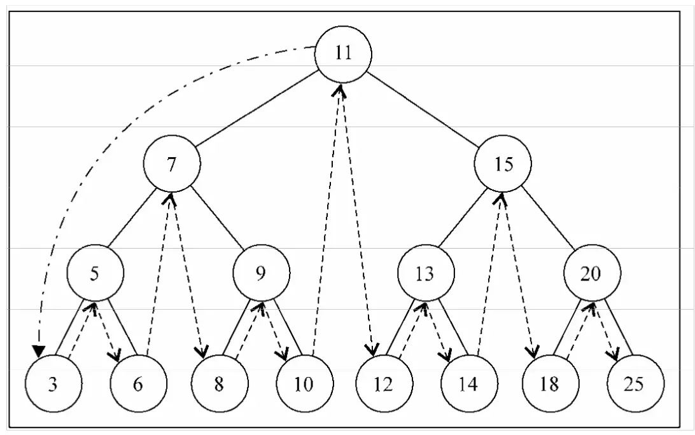
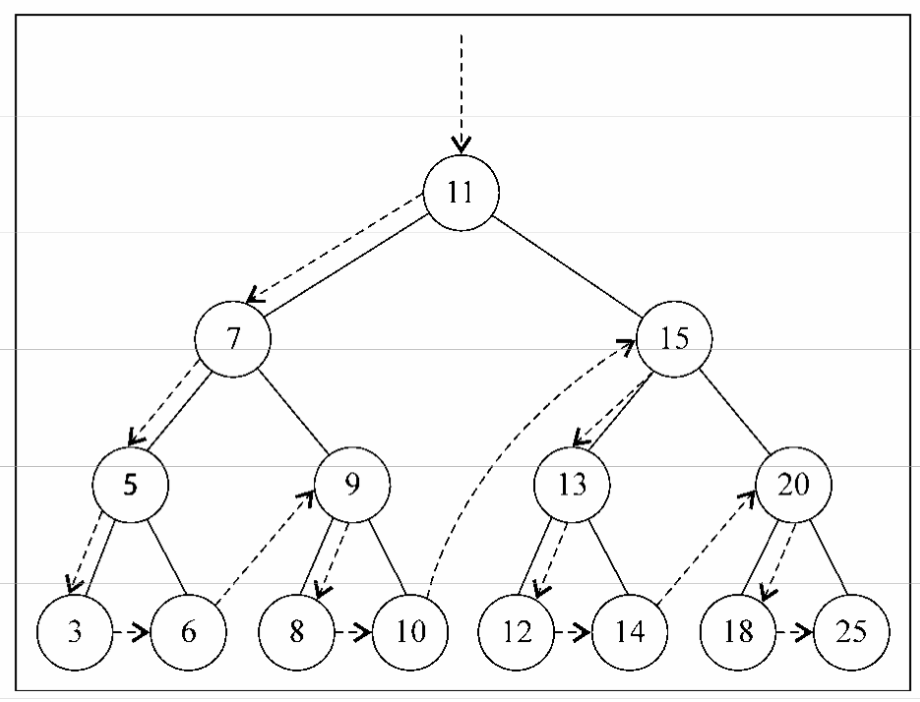
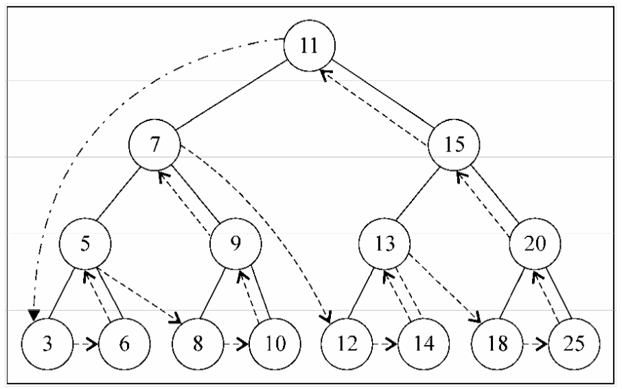
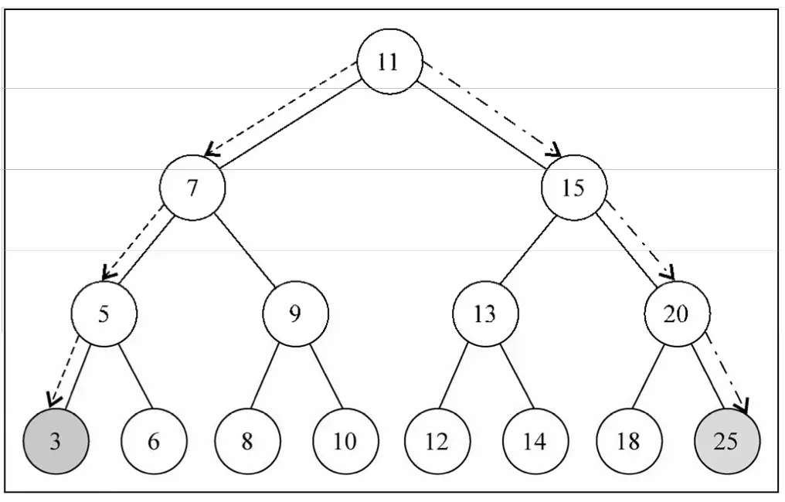
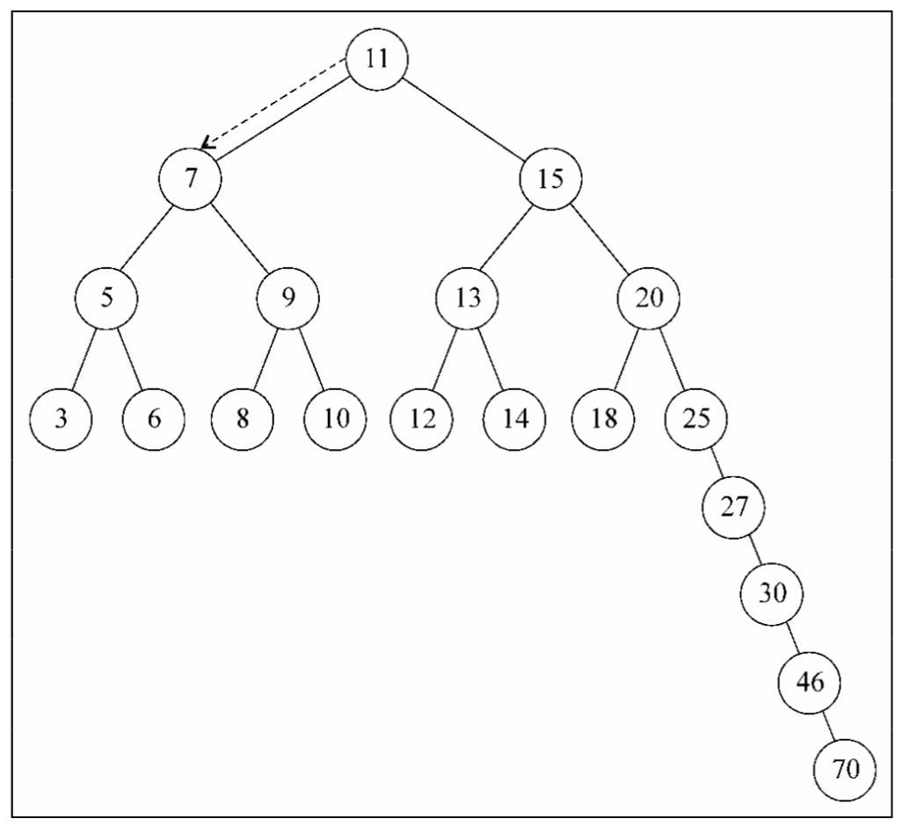

## 树

树是一种非顺序数据结构，一种分层数据的抽象模型，它对于存储需要快速查找的数据非常有用。

现实生活中最常见的树的例子是家谱，或是公司的组织架构图，如下图：

一个树结构包含一系列存在父子关系的节点。每个节点都有一个父节点（除了顶部的第一个 节点）以及零个或多个子节点：

树大概包含以下几种结构/属性：

* 节点
  * 根节点
  * 内部节点：非根节点、且有子节点的节点
  * 外部节点/页节点：无子节点的节点
* 子树：就是大大小小节点组成的树
* 深度：节点到根节点的节点数量
* 高度：树的高度取决于所有节点深度中的最大值
* 层级：也可以按照节点级别来分层

### 二叉树和二叉搜索树

二叉树中的节点最多只能有两个子节点：一个是左侧子节点，另一个是右侧子节点。这些定 义有助于我们写出更高效的向/从树中插人、查找和删除节点的算法。二叉树在计算机科学中的 应用非常广泛。

二叉搜索树（BST）是二叉树的一种，但是它只允许你在左侧节点存储（比父节点）小的值， 在右侧节点存储（比父节点）大（或者等于）的值。上图中就展现了一棵二叉搜索树。

注：不同于之前的链表和集合，在树中节点被称为"键"，而不是"项"。

下图展现了二叉搜索树数据结构的组织方式：

最终构建的树如下图：

### 树的遍历

遍历一棵树是指访问树的每个节点并对它们进行某种操作的过程。但是我们应该怎么去做呢？应该从树的顶端还是底端开始呢？从左开始还是从右开始呢？

访问树的所有节点有三种方式：中序、先序、后序。

**中序遍历**

中序遍历是一种以上行顺序访问 BST 所有节点的遍历方式，也就是以从最小到最大的顺序访 问所有节点。中序遍历的一种应用就是对树进行排序操作。

inOrderTraverse 方法接收一个回调函数作为参数，回调函数用来定义我们对遍历到的每个节点进行的操作，这也叫作访问者模式。

下面的图描绘了 inOrderTraverse 方法的访问路径：

**先序遍历**

先序遍历是以优先于后代节点的顺序访问每个节点的。先序遍历的一种应用是打印一个结构化的文档。

下面的图描绘了 preOrderTraverse 方法的访问路径:

**后序遍历**

后序遍历则是先访问节点的后代节点，再访问节点本身。后序遍历的一种应用是计算一个目录和它的子目录中所有文件所占空间的大小。

这个例子中，后序遍历会先访问左侧子节点，然后是右侧子节点，最后是父节点本身。

你会发现，中序、先序和后序遍历的实现方式是很相似的，唯一不同的是三行代码的执行顺序。

下面的图描绘了 postOrderTraverse 方法的访问路径:

**三种遍历访问顺序的不同：**

* 先序遍历：节点本身 => 左侧子节点 => 右侧子节点
* 中序遍历：左侧子节点 => 节点本身 => 右侧子节点
* 后序遍历：左侧子节点 => 节点本身 => 右侧子节点

**搜索最小值和最大值**

**更多关于二叉树的知识**

BST 存在一个问题：取决于你添加的节点数，树的一条边可能会非常深；也就是说，树的一 条分支会有很多层，而其他的分支却只有几层，如下图所示：

AVL 树：

AVL 树是一种自平衡二叉搜索树，AVL 树本质上是带了平衡功能的二叉查找树（二叉排序树，二叉搜索树），在 AVL 树中任何节点的两个子树的高度最大差别为一，也就是说这种树会在添加或移除节点时尽量试着成为一棵完全树，所以它也被称为高度平衡树。查找、插入和删除在平均和最坏情况下都是 `O(log n)`，增加和删除可能需要通过一次或多次树旋转来重新平衡这个树。

红黑树：

红黑树和 AVL 树类似，都是在进行插入和删除操作时通过特定操作保持二叉查找树的平衡，从而获得较高的查找性能；它虽然是复杂的，但它的最坏情况运行时间也是非常良好的，并且在实践中是高效的：它可以在 `O(log n)` 时间内做查找，插入和删除，这里的 n 是树中元素的数目。

红黑树是每个节点都带有颜色属性的二叉查找树，颜色或红色或黑色。在二叉查找树强制一般要求以外，对于任何有效的红黑树我们增加了如下的额外要求：

* 节点是红色或黑色
* 根节点是黑色
* 每个叶节点（NIL 节点，空节点）是黑色的
* 每个红色节点的两个子节点都是黑色。(从每个叶子到根的所有路径上不能有两个连续的红色节点)
* 从任一节点到其每个叶子的所有路径都包含相同数目的黑色节点

这些约束强制了红黑树的关键性质：从根到叶子的最长的可能路径不多于最短的可能路径的两倍长。结果是这个树大致上是平衡的。因为操作比如插入、删除和查找某个值的最坏情况时间都要求与树的高度成比例，这个在高度上的理论上限允许红黑树在最坏情况下都是高效的，而不同于普通的二叉查找树。

红黑树和 AVL 树一样都对插入时间、删除时间和查找时间提供了最好可能的最坏情况担保。这不只是使它们在时间敏感的应用如即时应用(real time application)中有价值，而且使它们有在提供最坏情况担保的其他数据结构中作为建造板块的价值；例如，在计算几何中使用的很多数据结构都可以基于红黑树。红黑树在函数式编程中也特别有用，在这里它们是最常用的持久数据结构之一，它们用来构造关联数组和集合，在突变之后它们能保持为以前的版本。除了 `O(log n)` 的时间之外，红黑树的持久版本对每次插入或删除需要 `O(log n)` 的空间。
