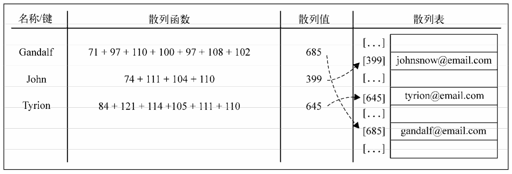
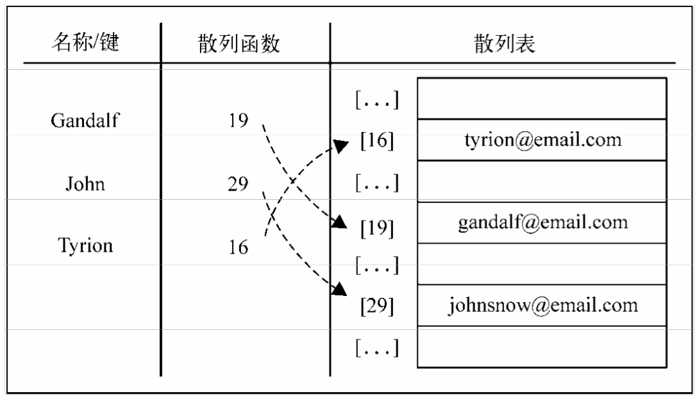
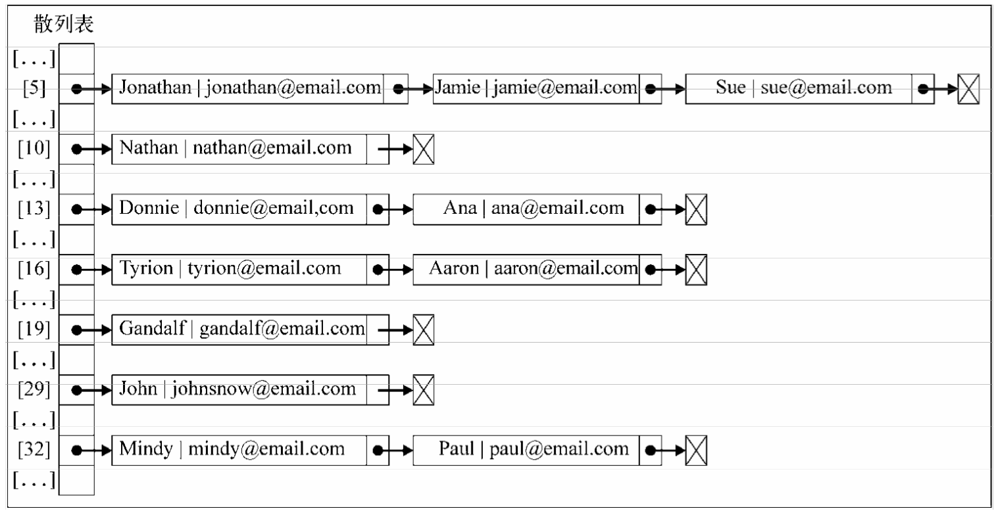
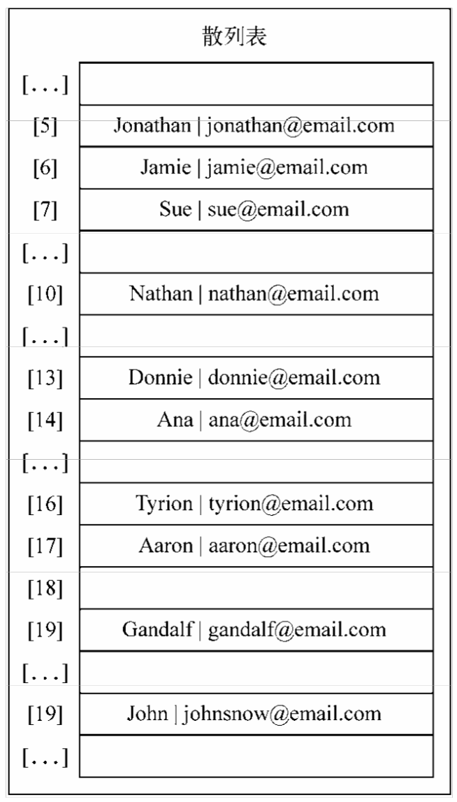

## 散列

HashTable 类，也叫 HashMap 类，是 Dictionary 类的一种散列表实现方式。

散列算法的作用是尽可能快地在数据结构中找到一个值。在上面的例子中，如果要在数据结构中获得一个值（使用 get 方法），需要遍历整个数据结构来得到它。如果使用散列函数，就知道值的具体位置，因此能够快速检索到该值，散列函数的作用是给定一个键值，然后返回值在表中的地址。

举个例子，我们继续使用上面字典中的代码示例。我们将要使用最常见的散列函数 - 'lose lose'散列函数，方法是简单地将每个键值中的每个字母的 ASCII 值相加。如下图：



对于 HashTable 类来说，我们不需要像 ArrayList 类一样从 table 数组中将位置也移除。由 于元素分布于整个数组范围内，一些位置会没有任何元素占据，并默认为 undefined 值。我们也 不能将位置本身从数组中移除（这会改变其他元素的位置），否则，当下次需要获得或移除一个 元素的时候，这个元素会不在我们用散列函数求出的位置上。

下面的图表展现了包含这三个元素的 HashTable 数据结构:



**散列表和散列集合**

散列表和散列映射是一样的，上面已经介绍了这种数据结构。

在一些编程语言中，还有一种叫作散列集合的实现。散列集合由一个集合构成，但是插人、 移除或获取元素时，使用的是散列函数。我们可以重用上面实现的所有代码来实现散列集合， 不同之处在于，不再添加键值对，而是只插入值而没有键。例如，可以使用散列集合来存储所有的英语单词（不包括它们的定义)。和集合相似，散列集合只存储唯一的不重复的值。

**处理散列表中的冲突**

有时候，一些键会有相同的散列值。不同的值在散列表中对应相同位置的时候，我们称其为冲突。如下代码：

```js
const hash = new HashTable();

hash.put('Gandalf', 'gandalf@email.com');
hash.put('John', 'johnsnow®email.com');
hash.put('Tyrion', 'tyrion@email.com');
hash.put('Aaron', 'aaronOemail.com');
hash.put('Donnie', 'donnie@email.com');
hash.put('Ana', 'ana©email.com');
hash.put('Jonathan', 'jonathan@email.com');
hash.put('Jamie', 'jamie@email.com');
hash.put('Sue', 'sueOemail.com');
hash.put('Mindy', 'mindy@email.com');
hash.put('Paul', 'paul©email.com');
hash.put('Nathan', 'nathan@email.com');
```

在上面代码中，Tyrion 和 Aaron 有相同的散列值（16)，Donnie 和 Ana 有相同的散列值（13)，Jonathan、Jamie 和 Sue 有相同的散列值（5), Mindy 和 Paul 也有相同的散列值（32)，导致最终的数据对象中，只有最后一次被添加/修改的数据会覆盖原本数据，进而生效。

使用一个数据结构来保存数据的目的显然不是去丢失这些数据，而是通过某种方法将它们全部保存起来；因此，当这种情况发生的时候就要去解决它。

处理冲突有几种方法：分离链接、线性探查和双散列法。下面介绍前两种方法。

**分离链接**

分离链接法包括为散列表的每一个位置创建一个链表并将元素存储在里面。它是解决冲突的 最简单的方法，但是它在 HashTable 实例之外还需要额外的存储空间。

例如，我们在之前的测试代码中使用分离链接的话，输出结果将会是这样：



* 在位置 5 上，将会有包含三个元素的 LinkedList 实例
* 在位置 13、16 和 32 上，将会有包含两个元素的 LinkedList 实例
* 在位置 10、19 和 29 上，将会有包含单个元素的 LinkedList 实例

对于分离链接和线性探查来说，只需要重写三个方法：put、get 和 remove 这三个方法，在 每种技术实现中都是不同的。

为了实现一个使用了分离链接的 HashTable 实例，我们需要一个新的辅助类来表示将要加人 LinkedList 实例的元素，在这里我们可以直接使用链表类。

**线性探查**

当想向表中某个位置加人一个新元素的时候，如果索引为 index 的位置已经被占据了，就尝试 index+1 的位置。如果 index+1 的位置也被占据了，就尝试 index+2 的位置，以此类推。如下图：



**更多函数**

我们实现的"lose lose"散列函数并不是一个表现良好的散列函数，因为它会产生太多的冲 突。如果我们使用这个函数的话，会产生各种各样的冲突。一个表现良好的散列函数是由几个方 面构成的：插人和检索元素的时间（即性能），当然也包括较低的冲突可能性。我们可以在网上 找到一些不同的实现方法。像：djb2、sdbm...，或者也可以实现自己的散列函数。

其中一个可以实现的比“lose lose”更好的散列函数是 djb2：

```js
class HashTable {
  static djb2HashCode(key) {
    let hash = 5381;
    for (let codePoint of key) {
      hash = hash * 33 + codePoint.charCodeAt();
    }
    return hash % 1013;
  }
}
```

使用 djb2 函数后，上面的散列表示例便不再有冲突。
