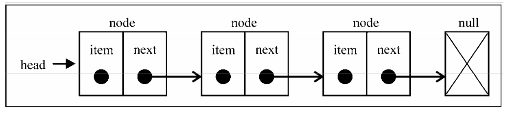

## 链表

要存储多个元素，数组（或列表）可能是最常用的数据结构。每种语言都实现了数组。这种数据结构非常方便，提供了一个便利的 `[]` 语法来访问它的元素。然而，这种数据结构有一个缺点：在大多数语言中，数组的大小是固定的，从数组的起点或中间插入或移除项的成本很高，因为需要移动元素；尽管 JavaScript 中的 `Array` 类方法可以帮我们做这些事，但背后的处理机制同样如此。

链表存储有序的元素集合，但不同于数组，链表中的元素在内存中并不是连续放置的。每个 元素由一个存储元素本身的节点和一个指向下一个元素的引用(也称指针或链接)组成。下图展示了链表的结构:

相对于传统的数组，链表的一个好处在于，添加或移除元素的时候不需要移动其他元素。然而，链表需要使用指针，因此实现链表时需要额外注意。

数组的另一个细节是可以直接访问任何位置的任何元素，而要想访问链表中间的一个元素，需要从起点(表头)开始迭代列表直到找到所需的元素。

现实中有许多链表的例子：一列火车是由一系列车厢/车皮组成的，每节车厢/车皮都相互连接，你很容易分离一节车皮，改变它的位置，添加或移除它。下图演示了一列火车，每节车皮都是列表的元素，车皮间的连接就是指针：

