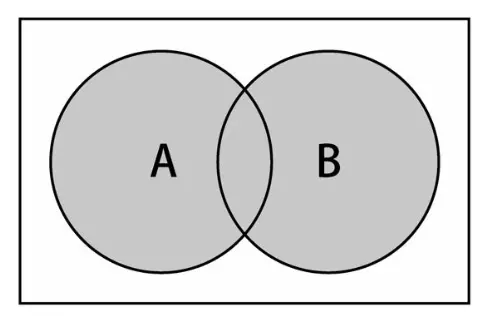
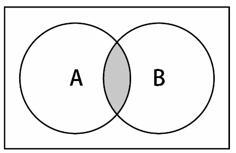
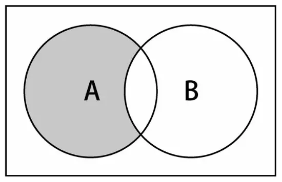
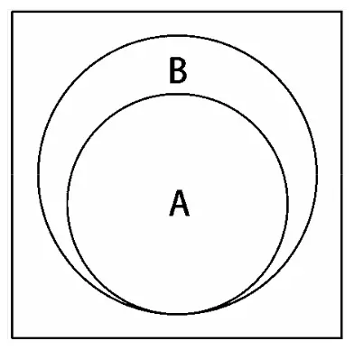

## 集合

集合是由一组无序且唯一（不能重复）的项组成的。这个数据结构使用了与有限集合相同的数学概念，但应用在计算机科学的数据结构中。

在数学中，集合是一组不同的对象（的集）。

比如说：一个由大于或等于 0 的证书组成的自然数集合：`N = { 0, 1, 2, 3, 4, 5, 6, ... }`，集合中的对象列表用 `{}` 包围。

集合是由一组一（即不能重的项组成的。这个数据结构使用了与有..合相同的数学..，但应用在.算..学的数据结构中。

> 目前 ES6 中已内置了 Set 类型的实现

## 对集合可以进行如下操作：

* 并集：对于给定的两个集合，返回一个包含两个集合中所有元素的新集合。‰
* 交集：对于给定的两个集合，返回一个包含两个集合中 Р 有元素的新集合。‰
* 差集：对于给定的两个集合，返回一个包含所有存在于第一个集合且不存在于第二个集合的元素的新集合。‰
* 子集：求证一个给定集合是否是另一集合的子集。

**并集**

并集的数学概念：集合 A 和 B 的并集，表示为 `A∪B`，定义如下：`A∪B = { x | x∈A ∨ x∈B }`，意思是 x（元素）存在于 A 中，或 x 存在于 B 中。如图：

**交集**

并集的数学概念：集合 A 和 B 的交集，表示为 `A∩B`，定义如下：`A∩B = { x | x∈A ∧ x∈B }`，意思是 x（元素）存在于 A 中，且 x 存在于 B 中。如图：

**差集**

差集的数学概念：集合 A 和 B 的差集，表示为 `A-B`，定义如下：`A-B = { x | x∈A ∧ x∉B }`，意思是 x（元素）存在于 A 中，且不 x 存在于 B 中。如图：

**子集**

子集的数学概念：集合 A 是 B 的子集，或者说集合 B 包含了集合 A，如图：

